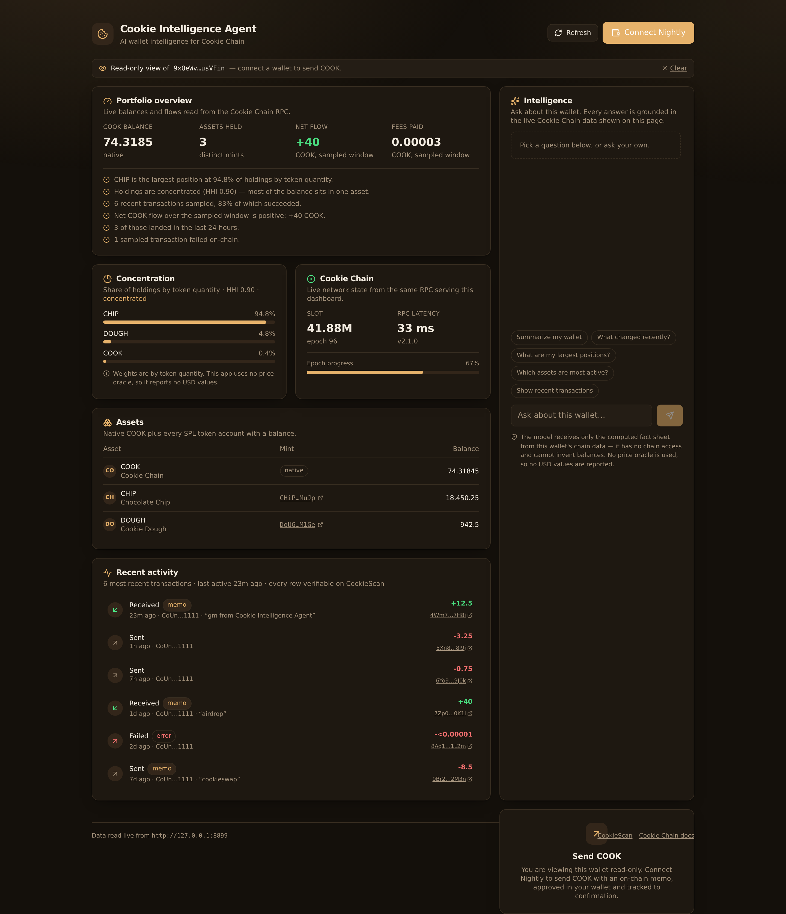
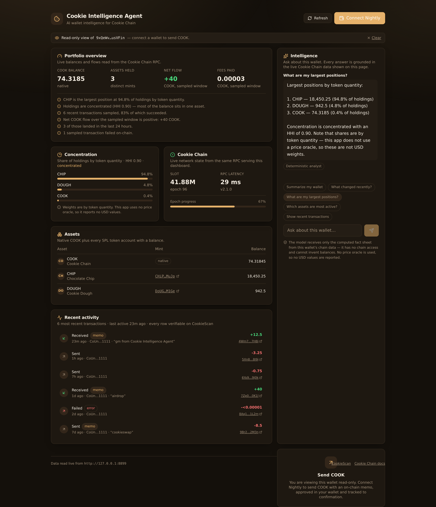
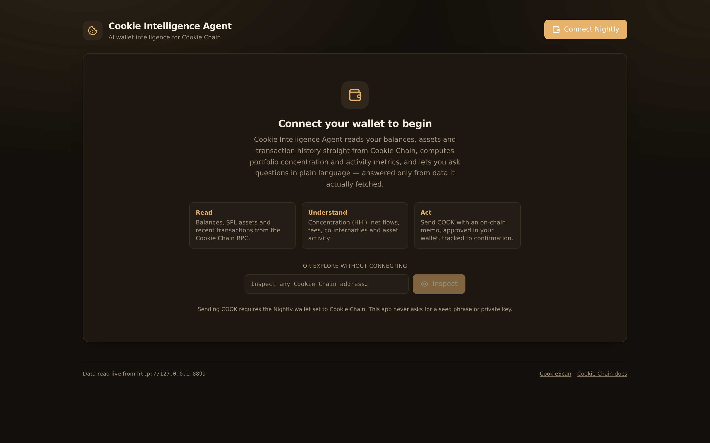
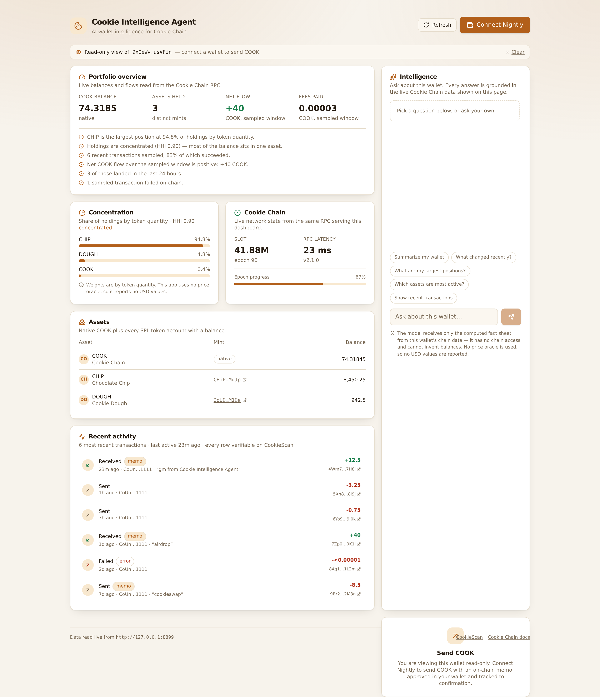
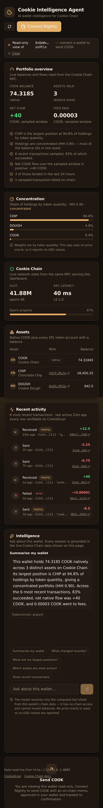

# 🍪 Cookie Intelligence Agent

**AI-powered wallet intelligence for [Cookie Chain](https://www.cookiechain.wtf/) — the community-operated SVM Layer 1.**

Connect a Nightly wallet (or paste any address) to read live balances, assets, portfolio
concentration and transaction history straight off Cookie Chain, ask questions about them
in plain language, and send COOK — with every factual claim traceable to data the app
actually fetched.

> **Built for the Superteam "Create an App on Cookie Chain" bounty.**

---

## Why this exists

Most "AI + wallet" demos let a language model narrate freely over a blockchain and hope it
doesn't invent a balance. This one is built so it **structurally cannot**.

The chain data is fetched in the browser, reduced to a deterministic **fact sheet** by a
pure, unit-tested analytics module, and only that fact sheet is handed to the model. The
model has no chain access, no tools and no memory. Every number it can say is a number you
can see on the page and verify on CookieScan.

And when no API key is configured, the same fact sheet is answered by a **deterministic
analyst** instead — so the product is fully useful with zero credentials.

---

## Screenshots

| Dashboard (dark) | Intelligence panel |
| --- | --- |
|  |  |

| Landing | Light theme | Mobile |
| --- | --- | --- |
|  |  |  |

> The dashboard screenshots were rendered against `scripts/mock-rpc.mjs`, a local fixture
> server, because the build environment has no outbound access to Cookie Chain. They
> demonstrate the UI and the analytics pipeline — **they are not chain data.** Point the app
> at `https://rpc.cookiescan.io` (the default) for real balances.

---

## Features

### 1. Wallet connection
- **Nightly wallet** via the official `@solana/wallet-adapter-nightly` adapter.
- Connected address displayed, copyable, and linked to CookieScan.
- **Network validation** — the genesis hash Nightly reports is compared against the genesis
  hash of the configured RPC. On mismatch the dashboard is *blocked* behind a modal with
  copy-paste instructions, so you can never read or sign against the wrong SVM chain.
- Clean disconnect, and explicit handling for "Nightly not installed" and "user rejected".

### 2. Wallet intelligence
- **Balances** — native COOK plus every SPL token account (Token and Token-2022), summed
  per mint, zero balances filtered out.
- **Assets** — enriched with names and symbols from the **Cookie DAS API**, degrading
  gracefully to mint addresses when DAS is unavailable (and saying so).
- **Recent activity** — parsed transactions with direction, signed COOK delta, fee,
  counterparty, on-chain memo, failure state, and a CookieScan link per row.
- **Portfolio concentration** — a real Herfindahl–Hirschman Index over holding weights,
  with a plain-language label (`single-asset` → `diversified`).
- **Cookie Chain vitals** — live slot, epoch progress, node version and measured RPC latency.

### 3. Intelligence panel
Answers questions such as:
- *Summarize my wallet* · *What changed recently?* · *What are my largest positions?*
- *Which assets are most active?* · *Show recent transactions*

Two grounded modes, labelled on every answer:
- **AI narration** (`ANTHROPIC_API_KEY` set) — Claude narrates the fact sheet under a strict
  system prompt: no invented numbers, no USD values, no financial advice, and explicit
  acknowledgement of data gaps.
- **Deterministic analyst** (no key) — the same questions answered by pure TypeScript.

### 4. On-chain action
A **native COOK transfer with an optional on-chain memo** (SPL Memo program) — deliberately
the simplest meaningful Cookie Chain transaction. Validated before the wallet is ever
prompted: address parsed and checked on-curve, self-sends rejected, amount bounded by
spendable balance with fee headroom.

### 5. Transaction feedback
Explicit `PENDING → CONFIRMED / FAILED` lifecycle showing the signature, a CookieScan
link, the confirmation slot, and human-readable errors — wallet rejection, insufficient
funds, expired blockhash and RPC unreachable are each translated into an actionable message
rather than a raw exception.

### 6. Read-only mode
Paste any Cookie Chain address (or share `/?address=…`) to inspect it without a wallet.
Sending stays gated behind a real wallet connection.

---

## Architecture

See **[docs/ARCHITECTURE.md](docs/ARCHITECTURE.md)** for the full diagram and the grounding
contract.

```
Browser ──── Solana JSON-RPC ────► rpc.cookiescan.io   (balances, tokens, history, vitals)
   │    └─── DAS getAssetsByOwner ► api.cookiescan.io  (token metadata, optional)
   │
   ├── intelligence.ts  pure · unit-tested · HHI, flows, counterparties → FACT SHEET
   │
   └── POST /api/ai ──► Claude (fact sheet only, no chain access)
                    └─► deterministic analyst when no API key
```

**The read path never touches the server.** The app has no database, no session store and no
server-side chain credentials. The only server code is the AI route, which exists solely to
keep the Anthropic key off the client.

---

## Cookie Chain integration

| Endpoint | URL | Used for |
| --- | --- | --- |
| RPC | `https://rpc.cookiescan.io` | balances, token accounts, signatures, parsed transactions, epoch, health, genesis hash |
| WebSocket | `wss://wss.cookiescan.io` | subscription endpoint for the connection |
| DAS API | `https://api.cookiescan.io` | `getAssetsByOwner` for token metadata |
| Explorer | `https://cookiescan.io` | every address, mint and signature links out to CookieScan |

Cookie Chain speaks the standard Solana JSON-RPC dialect, so the whole SVM toolchain
(`@solana/web3.js`, wallet-adapter, SPL programs, Metaplex DAS) works unchanged — only the
endpoint differs. Every endpoint is overridable by environment variable.

---

## Getting started

```bash
git clone https://github.com/fmencoder/cookie-intelligence-agent.git
cd cookie-intelligence-agent
npm install
npm run dev          # http://localhost:3000
```

That's it — no configuration required. The app defaults to public Cookie Chain
infrastructure and the deterministic analyst.

### Optional configuration

```bash
cp .env.example .env.local
```

| Variable | Default | Purpose |
| --- | --- | --- |
| `NEXT_PUBLIC_COOKIE_RPC_URL` | `https://rpc.cookiescan.io` | Cookie Chain JSON-RPC |
| `NEXT_PUBLIC_COOKIE_WSS_URL` | `wss://wss.cookiescan.io` | WebSocket endpoint |
| `NEXT_PUBLIC_COOKIE_DAS_URL` | `https://api.cookiescan.io` | Cookie DAS API |
| `NEXT_PUBLIC_COOKIE_EXPLORER_URL` | `https://cookiescan.io` | Explorer links |
| `ANTHROPIC_API_KEY` | *(unset)* | Enables AI narration. **Server-side only** — never prefix with `NEXT_PUBLIC_`. |
| `ANTHROPIC_MODEL` | `claude-sonnet-5` | Model for narration |

### Using the app

1. Install [Nightly](https://nightly.app/download) and add Cookie Chain as a custom SVM RPC
   (`https://rpc.cookiescan.io`).
2. Click **Connect Nightly**. If the wallet is on another network you'll get a blocking
   prompt with the RPC to paste.
3. Explore the dashboard, ask the intelligence panel questions, and send COOK.

No wallet? Paste any Cookie Chain address into the landing page to explore read-only.

### Deploying

Deploys to Vercel with no configuration — it is a stock Next.js App Router project.

```bash
npx vercel --prod
```

Set `ANTHROPIC_API_KEY` in the Vercel project's environment variables to enable AI
narration. Everything else has a working default.

---

## Development

```bash
npm run dev        # dev server
npm run build      # production build
npm test           # 36 unit tests
npm run typecheck  # tsc --noEmit

node scripts/mock-rpc.mjs   # local fixture RPC for offline UI work (see the file header)
```

### Tests

36 unit tests cover the parts where a bug would produce a *plausible but wrong* number —
exactly the failure mode that matters for a wallet analytics tool:

- HHI: single-asset, equal-weight, skewed, empty and negative-weight inputs
- concentration ranking and zero-balance filtering
- inflow/outflow separation, fee totals, success rate (including the empty-history
  divide-by-zero case)
- activity windows anchored to the latest transaction rather than wall-clock time
- counterparty and asset-activity ranking
- fact-sheet construction, including data-gap disclosure and explicit empty sections
- deterministic analyst intent routing and its refusal to invent history
- transfer validation: bad address, self-send, non-positive amount, fee headroom
- error humanisation, including passing unknown errors through unchanged
- the IEEE-754 formatting artifact (`10 ** -4 === 0.00009999999999999999`) that would
  otherwise leak into the UI

---

## Security

- **No seed phrase or private key is ever requested**, stored, or transmitted. The app has
  no key material at all.
- **Every transaction requires explicit wallet approval.** The app builds an unsigned
  transaction and hands it to Nightly.
- **No token approvals.** The single action is a native transfer plus a memo — there is no
  allowance to leave dangling.
- **No server secrets client-side.** `ANTHROPIC_API_KEY` is read only in the Node runtime of
  `/api/ai` and never serialised into the client bundle.
- **No fabricated chain state.** The model receives only computed facts; unavailable data is
  surfaced as an explicit warning rather than filled in.
- **Input validation before signing** — addresses are parsed and on-curve checked, amounts
  bounded, self-sends rejected.
- **No price oracle, therefore no USD values** anywhere in the product. Concentration is by
  token quantity and the UI says so on every surface that shows a share.

---

## Known limitations

- **Portfolio weights are by token quantity, not USD value.** Cookie Chain has no price
  oracle wired into this app. This is stated in the UI and enforced in the AI system prompt
  rather than papered over.
- **History is a 40-transaction sample**, not the full lifetime of the wallet. All
  derived statistics say "sampled window", and the 24h/7d counts are anchored to the most
  recent sampled transaction so they stay meaningful for dormant wallets.
- **Nightly's `genesisHash` is not exposed by every build.** When it is missing the app shows
  a non-blocking warning naming the RPC it is reading from, rather than blocking a
  legitimate user on a missing field.
- **NFTs are not itemised.** DAS is used for fungible token metadata; NFT galleries were out
  of scope for this build.
- **The build environment had no outbound access to Cookie Chain**, so the dashboard
  screenshots were produced against the local fixture RPC. Chain-connected verification
  needs a browser with network access to `rpc.cookiescan.io`.

---

## Tech stack

Next.js 16 (App Router) · React 19 · TypeScript · Tailwind CSS v4 · `@solana/web3.js` ·
`@solana/wallet-adapter-*` · Nightly · Anthropic SDK · Vitest · Vercel

## License

MIT
